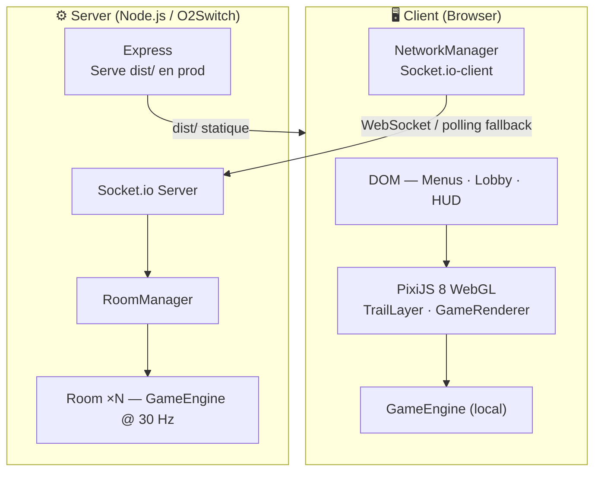
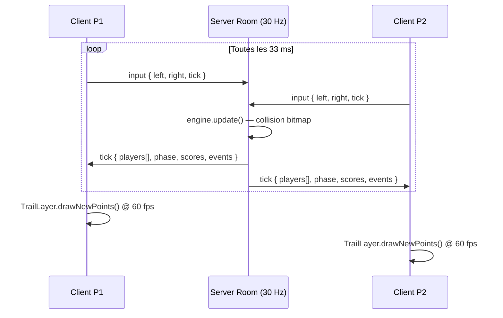
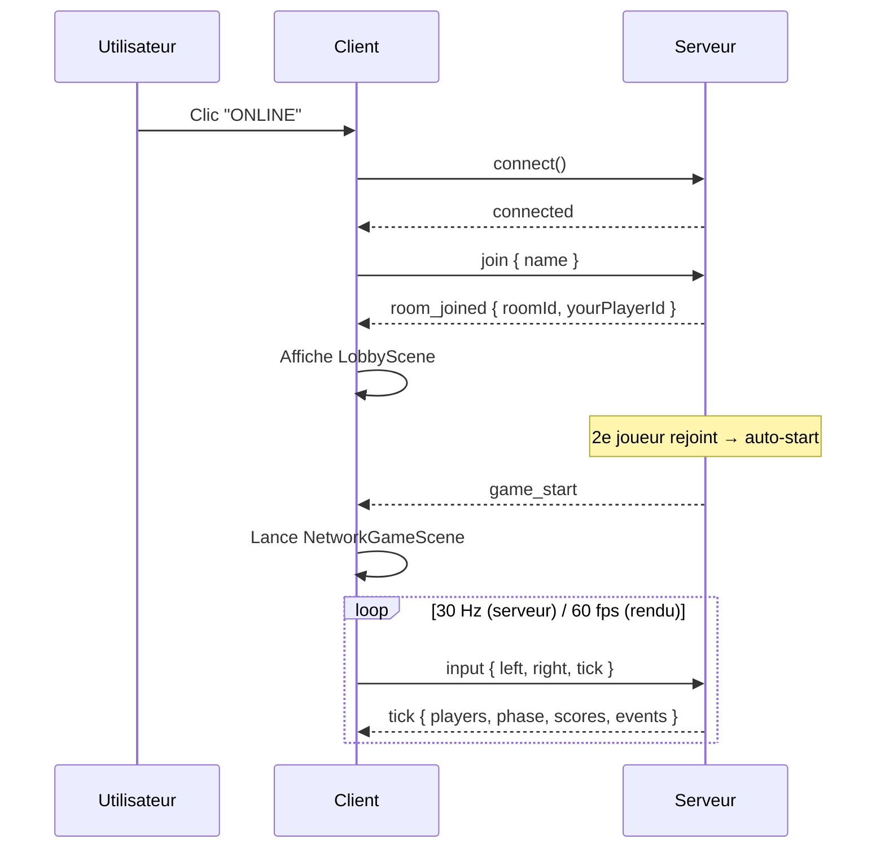
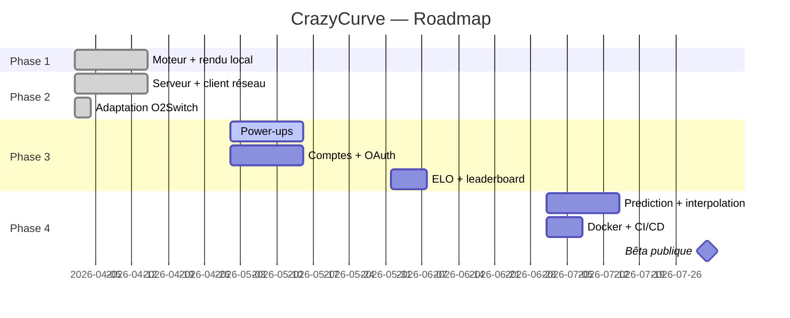

# CrazyCurve

> Multiplayer real-time Curve Fever clone — TypeScript · PixiJS 8 · Socket.io · Node.js


---

## Table des matières

- [Aperçu](#aperçu)
- [Architecture](#architecture)
- [Fonctionnalités](#fonctionnalités)
- [Stack technique](#stack-technique)
- [Démarrage rapide](#démarrage-rapide)
- [Mode multijoueur](#mode-multijoueur)
- [Déploiement O2Switch](#déploiement-o2switch)
- [Structure du projet](#structure-du-projet)
- [Roadmap](#roadmap)
- [FAQ](#faq)

---

## Aperçu

Les joueurs contrôlent une courbe qui se déplace en continu et laisse une traîne. Toucher une traîne ou un mur = mort. Dernier survivant = point. Premier à **5 points** gagne la partie.

```
┌─────────────────────────────────────────┐
│  ···                               ···  │
│     ╲                             ╱     │
│      ╲   P1 ●──────────          ╱      │
│       ╲                  ╱ P2   ╱       │
│        ╲                ●──────╱        │
│         ──────────────────────          │
│                                         │
└─────────────────────────────────────────┘
   P1: ← →      P2: A D      5 rounds
```

---

## Architecture

### Vue d'ensemble



### Boucle de jeu (mode online)



### Collision — Bitmap O(1)

```
Arena 800×600 → Uint8Array (480 000 octets)
  0 = vide   1 = P1   2 = P2 … 6 = P6

paint(x, y, id)  → écriture circulaire r=3px dans le tableau
check(x, y)      → lecture 1 pixel → collision instantanée
                   indépendant de la longueur des traînes
```

---

## Fonctionnalités

### Phase 1 ✅ — Prototype local

| Feature | Détail |
|---|---|
| Moteur déterministe | `core/GameEngine` — sans dépendance DOM, réutilisable côté serveur |
| Rendu WebGL | PixiJS 8, TrailLayer incrémental sur RenderTexture |
| Collision bitmap | Uint8Array O(1), indépendant de la taille des traînes |
| Trous aléatoires | Gaps dans la traîne (mécanique tactique) |
| 2 joueurs local | P1 `← →` · P2 `A D` · même clavier |
| Rounds & scoring | 5 rounds pour gagner |

### Phase 2 ✅ — Multijoueur en ligne

| Feature | Détail |
|---|---|
| Serveur autoritaire | Node.js + Socket.io, boucle fixe 30 Hz |
| Rooms dynamiques | Jusqu'à 6 joueurs, auto-start à 2 |
| Protocol typé | Types Socket.io partagés client↔serveur (TypeScript) |
| Fallback polling | Compatible Passenger/Apache (O2Switch) |
| Lobby temps réel | Liste joueurs, code room |
| IGameState interface | Renderer unique pour mode local ET réseau |

### Phase 3 🔜 — Power-ups & Progression

| Bonus | Effet | Cible |
|---|---|---|
| Vitesse± | Accélère / ralentit | Soi / Adversaires |
| Taille± | Traîne épaisse / fine | Adversaires / Soi |
| Gomme | Efface une zone de traîne | Zone locale |
| Bouclier | Traversée de traînes | Soi |
| Inverseur | Gauche↔droite inversés | Adversaires |
| Traîne fantôme | Traîne invisible temporaire | Soi |

### Phase 4 🔜 — Production

- Comptes (email + OAuth Google) · ELO · Leaderboard
- Client-side prediction + interpolation réseau
- Delta compression des ticks
- Cosmétiques (couleur, style de traîne, XP)
- Docker + CI/CD GitHub Actions

---

## Stack technique

| Couche | Technologie | Version |
|---|---|---|
| Rendu | PixiJS (WebGL) | 8.x |
| Frontend | TypeScript strict | 5.7 |
| Build | Vite | 6.x |
| Réseau client | Socket.io-client | 4.x |
| Serveur HTTP | Express | 4.x |
| Temps réel | Socket.io | 4.x |
| Runtime serveur | Node.js | 22 |
| Bundle prod | esbuild | 0.25 |
| Tests | Vitest | 2.x |
| Qualité | ESLint 9 + Prettier 3 | — |

---

## Démarrage rapide

### Prérequis

```bash
node -v   # >= 22
npm -v    # >= 10
```

### Installation

```bash
git clone https://github.com/artkabis/crazycurve.git
cd crazycurve
git checkout claude/curvefever-exploration-H2vUb
npm install
```

### Mode local (2 joueurs, même clavier)

```bash
npm run dev
# → http://localhost:5173   Cliquer "LOCAL (2P)"
```

### Mode multijoueur (développement)

```bash
# Terminal 1
npm run server:dev

# Terminal 2
npm run dev
# Ouvrir 2 onglets sur http://localhost:5173 → ONLINE
```

| Joueur | Gauche | Droite |
|---|---|---|
| P1 | `←` | `→` |
| P2 | `A` | `D` |
| Online | `←` | `→` (chaque joueur sur sa machine) |

---

## Mode multijoueur

### Flow de connexion



### Protocole réseau

**Client → Serveur**
```ts
socket.emit('join',  { name: string, roomId?: string })
socket.emit('input', { tick: number, left: boolean, right: boolean })
```

**Serveur → Client**
```ts
socket.on('room_joined',   ({ roomId, yourPlayerId, players }))
socket.on('player_joined', (player: PlayerInfo))
socket.on('game_start',    ())
socket.on('tick',          ({ tick, phase, round, countdown, players, events, scores }))
socket.on('error',         (message: string))
```

---

## Déploiement O2Switch

> Architecture : **tout-en-un** — Express sert `dist/` (front) + Socket.io (back) sur le port géré par Phusion Passenger.

### Étape 1 — Builder en local

```bash
npm run build:all
# → dist/                    (frontend Vite)
# → server/dist/server.cjs   (backend bundlé esbuild, prêt pour Node)
```

### Étape 2 — Configurer dans cPanel

```
cPanel → Setup Node.js App → Create Application

  Node.js version   : 22.x
  Application mode  : Production
  Application root  : /home/<user>/crazycurve
  Application URL   : game.tondomaine.fr
  Startup file      : server/dist/server.cjs
```

**Variables d'environnement** (cPanel → Node.js App → Env Vars) :

```
NODE_ENV = production
```

> `PORT` est injecté automatiquement par Passenger — ne pas le redéfinir.

### Étape 3 — Déployer via SSH

```bash
ssh user@ssh.tonserveur.o2switch.net
cd ~/crazycurve
git pull origin claude/curvefever-exploration-H2vUb
npm install --omit=dev
npm run build:all
# Puis : cPanel → Node.js App → Restart
```

### Étape 4 — Vérifier

```bash
curl https://game.tondomaine.fr/health
# {"status":"ok","uptime":12.3,"rooms":0}
```

### Notes spécifiques O2Switch

| Point | Comportement |
|---|---|
| WebSockets | Tentés en priorité via LiteSpeed |
| Fallback | Polling HTTP automatique si WS bloqués |
| PORT | Injecté par Passenger — ne pas hardcoder |
| Restart | cPanel ou `touch tmp/restart.txt` |
| Logs | cPanel → Errors / Node.js App logs |

---

## Structure du projet

```
crazycurve/
├── src/                           # Frontend
│   ├── core/                      # ← Isomorphe client/serveur
│   │   ├── constants.ts           # Arena, physics, palette 6 joueurs
│   │   ├── types.ts               # IGameState, CurveRenderData, GameEvents…
│   │   ├── EventEmitter.ts        # Émetteur typé
│   │   ├── GameEngine.ts          # Machine d'état (countdown→playing→round_over)
│   │   ├── entities/Curve.ts      # Physique, gaps, trail points
│   │   └── systems/
│   │       ├── CollisionSystem.ts # Uint8Array bitmap O(1)
│   │       └── ScoreSystem.ts
│   ├── renderer/
│   │   ├── TrailLayer.ts          # RenderTexture incrémentale (PixiJS 8)
│   │   └── GameRenderer.ts        # Accepte IGameState (local ou réseau)
│   ├── input/InputManager.ts
│   ├── network/
│   │   ├── protocol.ts            # Types Socket.io partagés
│   │   ├── NetworkManager.ts      # Client WS + polling
│   │   └── NetworkGameState.ts    # IGameState ← ticks serveur
│   ├── scenes/
│   │   ├── MenuScene.ts           # Local / Online
│   │   ├── GameScene.ts           # Mode local (ticker PixiJS)
│   │   ├── NetworkGameScene.ts    # Mode online (ticks serveur)
│   │   ├── LobbyScene.ts          # Salle d'attente
│   │   └── GameOverScene.ts
│   ├── app.ts                     # Orchestrateur
│   ├── main.ts
│   └── style.css
│
├── server/
│   ├── src/
│   │   ├── game/
│   │   │   ├── Room.ts            # Boucle 30 Hz + GameEngine serveur
│   │   │   └── RoomManager.ts     # Registre rooms, auto-start
│   │   └── server.ts              # Express + Socket.io + dist/ en prod
│   └── tsconfig.json
│
├── CAHIER_DES_CHARGES.md
├── index.html
├── package.json                   # Scripts : dev, build:all, start, server:dev
├── tsconfig.json
├── vite.config.ts                 # Proxy /socket.io → :3001 en dev
├── eslint.config.js
└── prettier.config.js
```

---

## Roadmap



---

## FAQ

<details>
<summary><strong>Le jeu fonctionne-t-il sans serveur ?</strong></summary>

Oui. Le mode **LOCAL (2P)** tourne entièrement dans le navigateur. Seul le mode **ONLINE** nécessite le serveur Node.js.

</details>

<details>
<summary><strong>Combien de rooms simultanées sur O2Switch ?</strong></summary>

Chaque room consomme ~480 KB (bitmap) + CPU d'une boucle 30 Hz. Sur un mutualisé O2Switch, prévoir 20–50 rooms max (ressources partagées). Pour plus, passer sur un VPS.

</details>

<details>
<summary><strong>Pourquoi le mode online semble-t-il moins fluide ?</strong></summary>

Les positions arrivent à 30 Hz (serveur) mais l'affichage tourne à 60 fps. Sans **client-side prediction** (Phase 4), les courbes ont une légère inertie. L'interpolation est prévue en Phase 4.

</details>

<details>
<summary><strong>Socket.io ne se connecte pas sur O2Switch — que faire ?</strong></summary>

1. Tester `/health` — si 200, le serveur tourne.
2. Console navigateur : si WebSocket échoue, Socket.io bascule en **polling HTTP** automatiquement.
3. Si même le polling échoue : vérifier que le sous-domaine pointe bien vers l'Application Root du Node.js App cPanel.

</details>

<details>
<summary><strong>Comment redémarrer après un déploiement ?</strong></summary>

```bash
# Via SSH (Passenger détecte ce fichier)
touch ~/crazycurve/tmp/restart.txt

# Ou via cPanel → Setup Node.js App → Restart
```

</details>

<details>
<summary><strong>Les données sont-elles persistées ?</strong></summary>

Non en Phase 1 & 2 — tout est en mémoire (perdu au restart). La **Phase 3** introduira PostgreSQL pour comptes, stats et historique de parties.

</details>

<details>
<summary><strong>Comment ajouter un 3e joueur en local ?</strong></summary>

Le mode local est limité à P1+P2 (même clavier). Pour 3+ joueurs, utiliser le mode **ONLINE** en local : lancer `npm run server:dev` + ouvrir plusieurs onglets sur `localhost:5173`.

</details>

---

<sub>CrazyCurve · TypeScript · PixiJS 8 · Socket.io · Vite · Node.js 22</sub>
