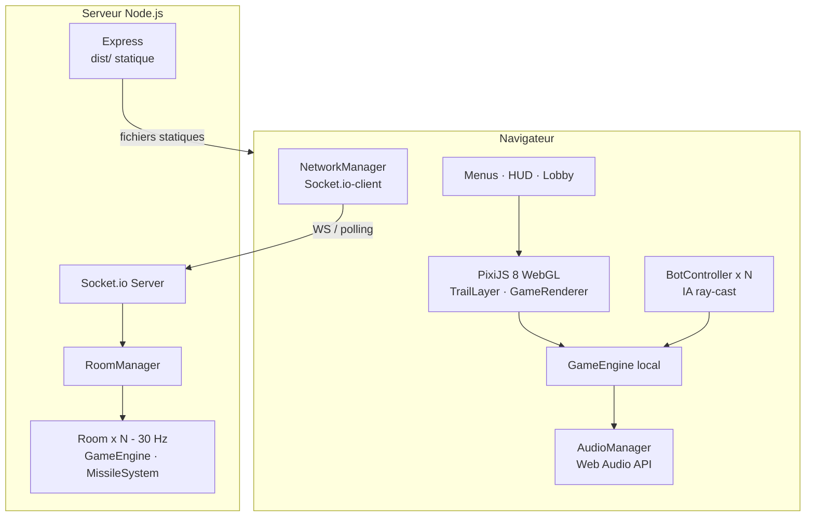
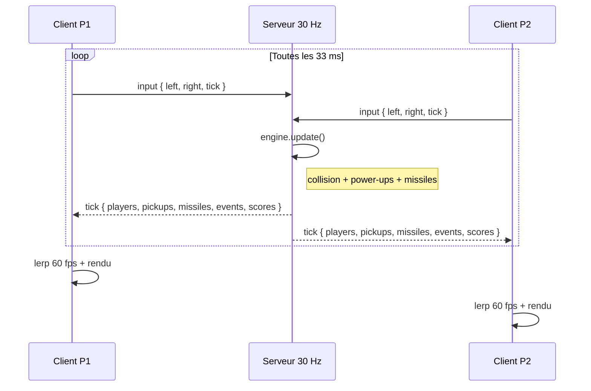
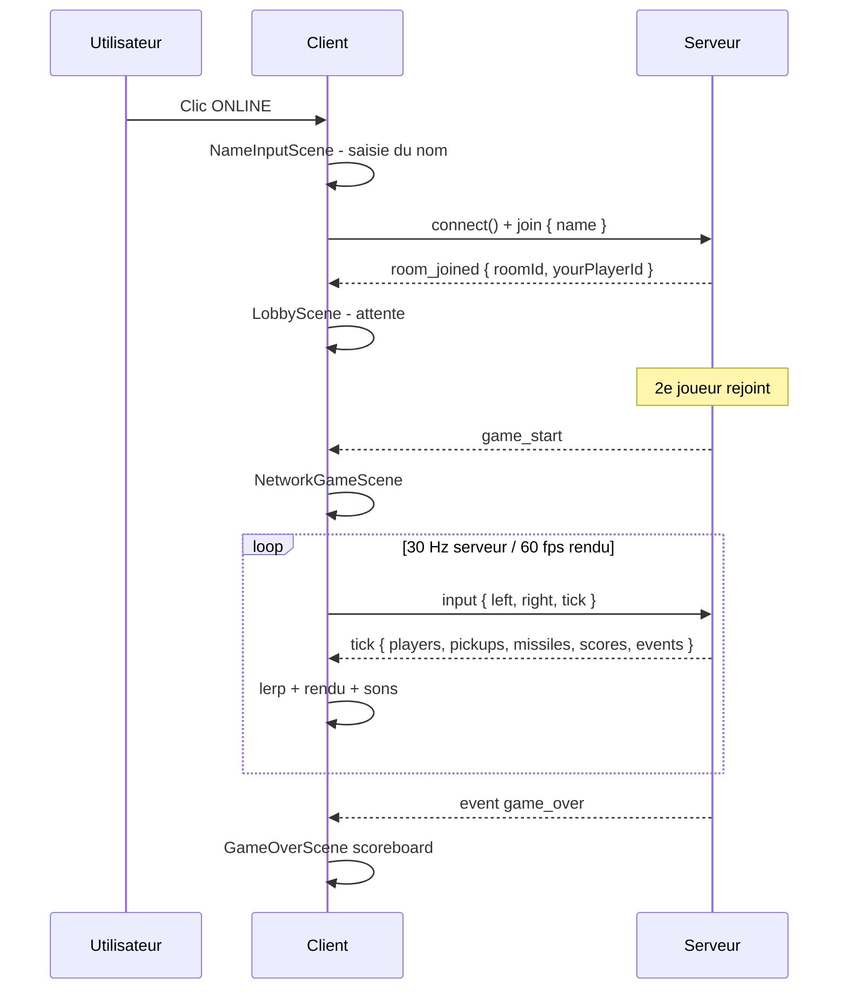
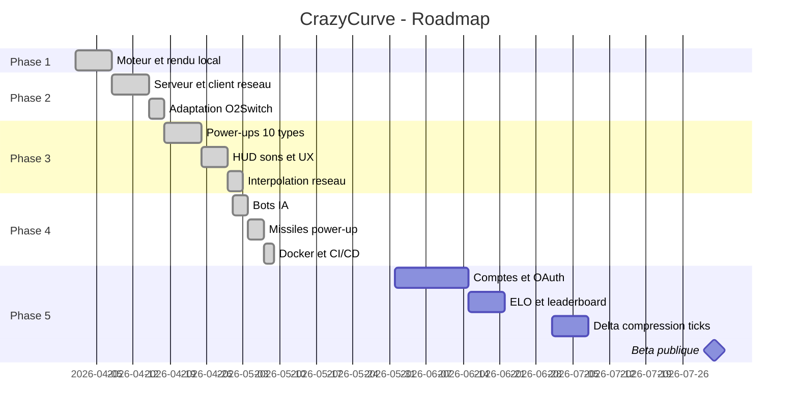

# 🎮 CrazyCurve

> Clone temps-réel de Curve Fever — TypeScript · PixiJS 8 · Socket.io · Node.js

[](#-roadmap)
[](#-déploiement-docker)
[](#)
[](https://nodejs.org)
[](https://www.typescriptlang.org)

---

## 📋 Table des matières

| Navigation | |
|:---|:---|
| [🎯 Aperçu](#-aperçu) | [🔊 Sons](#-sons) |
| [🏗 Architecture](#-architecture) | [🛠 Stack technique](#-stack-technique) |
| [✨ Fonctionnalités](#-fonctionnalités) | [🚀 Démarrage rapide](#-démarrage-rapide) |
| [💥 Power-ups](#-power-ups) | [🌐 Mode multijoueur](#-mode-multijoueur) |
| [🤖 Bots IA](#-bots-ia) | [🐳 Déploiement Docker](#-déploiement-docker) |
| [📁 Structure](#-structure-du-projet) | [🖥 Déploiement O2Switch](#-déploiement-o2switch) |
| [🗺 Roadmap](#-roadmap) | [❓ FAQ](#-faq) |

---

## 🎯 Aperçu

Les joueurs contrôlent une courbe se déplaçant en continu qui laisse une traîne permanente.
Toucher une traîne ou un mur = mort. Dernier survivant = point. Premier à **10 points** gagne.

```
┌──────────────────────────────────────────────────────────┐
│                                              [ FAST ⚡ ]  │
│   ───────────────────────● P1                            │
│                           ╲                              │
│             🤖 BOT HARD    ╲  ●──── 🚀 ──────────>       │
│                             ╲      [ FIRE ]              │
│                              ●──────────── P2            │
│                                                          │
│  P1 ████████  P2 ██████  BOT ███████████                 │
└──────────────────────────────────────────────────────────┘
     P1: ← →        P2: A D        BOT: HARD
```

> [!TIP]
> **Mode LOCAL (2–6P)** : 100 % navigateur, aucun serveur requis. Les bots IA remplacent les joueurs humains. **Mode ONLINE** : serveur Node.js autoritaire à 30 Hz avec interpolation côté client.

---

## 🏗 Architecture

### Vue d'ensemble



### Boucle de jeu — mode online



### Interpolation réseau

```
Tick serveur (33 ms)         Frames rendu (60 fps)
       │                      │    │    │    │
       ▼                      ▼    ▼    ▼    ▼
 prev = current          x = lerp(prev, target, Δt / 33 ms)
 target = snap.x/y       tête lissée entre les ticks
 lastTickAt = now()      traîne peinte à la pos. autoritaire
```

> [!NOTE]
> Les propriétés `x/y/angle` de `ShadowCurve` sont des **getters** calculant `lerp(prev, target, α)` via `performance.now()` — 60 fps fluides depuis des ticks 30 Hz, sans client-side prediction.

### Collision — bitmap O(1)

```
Arena 800 × 600 px  →  Uint8Array (480 000 octets)

  0 = vide   1 = P1   2 = P2  ...  6 = P6

  paint(x, y, id, r)   écriture circulaire de rayon r
  check(x, y)          lecture 1 octet — collision instantanée
  erase(x, y, r)       remise à 0 circulaire (ERASE / missile)
```

---

## ✨ Fonctionnalités

### Phase 1 — Prototype local ✅

| Feature | Détail |
|:---|:---|
| Moteur déterministe | `GameEngine` sans dépendance DOM — réutilisable côté serveur |
| Rendu WebGL | PixiJS 8 · `TrailLayer` incrémental sur `RenderTexture` |
| Collision bitmap | `Uint8Array` O(1) · rayon variable THIN/THICK |
| Trous aléatoires | Gap toutes les 5–9 s · durée 0,6–1,1 s |
| Scoring | Premier à **10 points** (`SCORE_TO_WIN`) |

### Phase 2 — Multijoueur en ligne ✅

| Feature | Détail |
|:---|:---|
| Serveur autoritaire | Node.js + Socket.io · boucle fixe **30 Hz** |
| Rooms dynamiques | 2–6 joueurs · auto-start à 2 |
| Protocol typé | Types Socket.io partagés client ↔ serveur (TypeScript) |
| Fallback polling | Compatible Passenger / Apache (O2Switch) |
| Interpolation réseau | `ShadowCurve` lerp · 60 fps depuis ticks 30 Hz |
| Interface unifiée | `IGameState` → même renderer local ET réseau |

### Phase 3 — Power-ups & UX ✅

| Feature | Détail |
|:---|:---|
| 10 power-ups | FAST · SLOW · REV · FREEZE · GHOST · THIN · THICK · WARP · SHIELD · ERASE |
| Spawn dynamique | Toutes les **6 s** · max **5 actifs** · position safe aléatoire |
| HUD effets actifs | Labels colorés par joueur, mis à jour en temps réel |
| Flèche de direction | Pendant le décompte (Curve Fever classique) |
| Scoreboard final | Trié par score · noms + couleurs · 👑 gagnant |
| Sons Web Audio | 8 sons synthétisés — aucun fichier audio |
| Saisie du nom | `NameInputScene` · touche Entrée · fallback aléatoire |

### Phase 4 — Bots, Missiles, Docker, CI/CD ✅

| Feature | Détail |
|:---|:---|
| **Bots IA** | Ray-cast look-ahead · 3 niveaux : EASY / MEDIUM / HARD |
| **Bot setup UI** | Toggle BOT par slot dans `PlayerSetupScene` |
| **Missiles** | Power-up FIRE · projectile à **3,5×** la vitesse de courbe |
| **Missiles réseau** | `missiles[]` dans chaque `TickPayload` · event `missile_hit` |
| **Docker** | Multi-stage build Node 22 Alpine — image production légère |
| **CI/CD** | GitHub Actions : lint + test + `build:all` sur `main` / `claude/**` |
| **Son missile** | Carré 880 Hz suivi de sawtooth 440 Hz |

---

## 💥 Power-ups

> [!NOTE]
> Les pickups apparaissent comme des cercles animés (pulsation). Collecte au contact dans un rayon de **12 px**.

| Icône | Nom | Effet | Cible | Durée |
|:---:|:---|:---|:---:|:---:|
| ⚡ | **FAST** | Vitesse ×1,7 | Soi | 5 s |
| 🐌 | **SLOW** | Vitesse ×0,5 | Adversaires | 5 s |
| ↔ | **REV** | Contrôles inversés | Adversaires | 4 s |
| ❄️ | **FREEZE** | Immobilise complètement | Adversaires | 3 s |
| 👻 | **GHOST** | Traîne invisible + traversée des trails | Soi | 4 s |
| ─ | **THIN** | Traîne fine (rayon ×0,5) | Soi | 6 s |
| █ | **THICK** | Traîne épaisse (rayon ×2,5) | Adversaires | 4 s |
| ✦ | **WARP** | Téléportation aléatoire + gap de sécurité | Soi | instant |
| 🛡️ | **SHIELD** | Absorbe 1 collision de traîne | Soi | 10 s |
| ⊗ | **ERASE** | Efface les traînes dans un disque de **44 px** | Soi | instant |
| 🚀 | **FIRE** | Lance un missile dans la direction actuelle | Soi | instant |

### Interactions remarquables

> [!TIP]
> - **GHOST + THICK** ennemi : traversée de leur traîne épaisse sans mourir
> - **SHIELD + REV** : bouclier actif mais contrôles inversés — désorientation totale
> - **ERASE** : utilise `blendMode: 'erase'` de PixiJS — pixels rendus transparents, pas juste masqués
> - **WARP** : gap automatique de 1,5 s à la réapparition pour éviter l'auto-collision
> - **FIRE** : contact direct = mort · impact sur traîne = efface un disque de 10 px sur le bitmap

---

## 🤖 Bots IA

### Configuration dans PlayerSetupScene

Chaque slot joueur dispose d'un bouton **BOT**. Quand activé, les touches sont remplacées par un sélecteur de difficulté :

```
┌─ PLAYER 2 ──────────────────────────────┐
│  [ BOT ✓ ]   [ EASY ]  [MEDIUM]  [ HARD ]│
└──────────────────────────────────────────┘
```

### Algorithme — ray-cast look-ahead

Le bot simule N pas dans **3 directions** (tout droit, gauche ×3, droite ×3 fois le `turnRate`) et choisit la voie avec le plus de pas libres.

| Difficulté | Pas scannés | Bruit de décision | Bonus |
|:---:|:---:|:---:|:---|
| **EASY** | 12 | ±25 % | — |
| **MEDIUM** | 30 | ±8 % | — |
| **HARD** | 60 | 0 % | Tracking du pickup le plus proche quand dégagement > 20 pas |

```typescript
// BotController.computeInput() — logique principale
const straight  = scan(x, y, angle,                speed, r, collision);
const leftFree  = scan(x, y, angle - turnRate * 3, speed, r, collision);
const rightFree = scan(x, y, angle + turnRate * 3, speed, r, collision);

const best = Math.max(straight, leftFree, rightFree);
if (best === straight && straight > 4) return { left: false, right: false };
if (leftFree >= rightFree)             return { left: true,  right: false };
return                                        { left: false, right: true  };
```

> [!NOTE]
> Les bots sont **client-side uniquement** (mode LOCAL). Le serveur multijoueur ne gère pas de bots — chaque humain connecté pilote sa courbe depuis sa machine.

---

## 🔊 Sons

`AudioManager` utilise la **Web Audio API** pure — aucun fichier audio, tout est synthétisé par oscillateurs.

| Événement | Type d'oscillateur | Fréquence |
|:---|:---:|:---|
| Décompte 3, 2, 1 | Carré | 523 Hz |
| GO ! | Deux tons | 784 Hz → 1047 Hz |
| Mort | Sawtooth descendant | 440 Hz → 110 Hz |
| Pickup standard | Deux bips | 880 Hz → 1320 Hz |
| SHIELD activé | Harmonique | 523 Hz + 659 Hz |
| ERASE | Deux tons descendants | 660 Hz → 440 Hz |
| **Impact missile** | **Carré + Sawtooth** | **880 Hz → 440 Hz** |
| Victoire round | Arpège montant | 523 → 659 → 784 Hz |
| Victoire partie | Arpège montant | 523 → 659 → 784 → 1047 Hz |

> [!IMPORTANT]
> Les navigateurs bloquent `AudioContext` avant toute interaction. `AudioManager.unlock()` est déclenché sur le premier `pointerdown`. **Cliquer une fois dans la page** si aucun son ne joue.

---

## 🛠 Stack technique

| Couche | Technologie | Version |
|:---|:---|:---:|
| Rendu | PixiJS WebGL | 8.x |
| Frontend | TypeScript strict | 5.7 |
| Build frontend | Vite | 6.x |
| Réseau client | Socket.io-client | 4.x |
| Serveur HTTP | Express | 4.x |
| Temps réel | Socket.io | 4.x |
| Runtime | Node.js | 22 |
| Bundle serveur | esbuild | 0.25 |
| Tests | Vitest | 2.x |
| Qualité | ESLint 9 + Prettier 3 | — |
| Conteneurs | Docker multi-stage | — |
| CI/CD | GitHub Actions | — |

---

## 🚀 Démarrage rapide

### Prérequis

```bash
node -v   # >= 22
npm -v    # >= 10
```

### Installation

```bash
git clone https://github.com/artkabis/crazycurve.git
cd crazycurve
git checkout claude/finalize-project-sZMVX
npm install
```

### Mode local — 1 à 6 joueurs (humains et/ou bots)

```bash
npm run dev
# → http://localhost:5173
# Cliquer "LOCAL (2–6P)"
# Dans PlayerSetupScene : activer BOT sur les slots voulus, choisir la difficulté
```

### Mode multijoueur — développement

```bash
# Terminal 1 — serveur
npm run server:dev

# Terminal 2 — client
npm run dev
# Ouvrir plusieurs onglets → ONLINE → saisir son nom → JOIN
```

### Contrôles clavier

| Slot | Gauche | Droite |
|:---:|:---:|:---:|
| P1 | `←` | `→` |
| P2 | `A` | `D` |
| P3 | `N` | `M` |
| P4 | `F` | `G` |
| P5 | `1` | `2` |
| P6 | `7` | `8` |

> [!TIP]
> En mode ONLINE, chaque joueur utilise `←` `→` depuis sa propre machine.

---

## 🌐 Mode multijoueur

### Flow de connexion



### Protocole réseau

**Client → Serveur**

```typescript
socket.emit('join',  { name: string, roomId?: string })
socket.emit('input', { tick: number, left: boolean, right: boolean })
```

**Serveur → Client (tick @ 30 Hz)**

```typescript
socket.on('tick', ({
  tick:      number,
  phase:     'countdown' | 'playing' | 'round_over' | 'game_over',
  round:     number,
  countdown: number,
  players:   PlayerSnapshot[],   // x, y, angle, trailRadius, ghostTrail, activeEffects
  pickups:   PickupSnapshot[],   // id, x, y, type
  missiles:  MissileSnapshot[],  // id, x, y, angle, ownerId
  events:    NetGameEvent[],     // player_died | round_over | game_over | erase_zone | missile_hit
  scores:    Record<number, number>
}))
```

---

## 🐳 Déploiement Docker

```bash
# Builder l'image
docker build -t crazycurve .

# Lancer sur le port 3001
docker run -p 3001:3001 crazycurve

# Ouvrir → http://localhost:3001
```

Le `Dockerfile` utilise un **build multi-stage** :

| Stage | Image de base | Actions |
|:---:|:---|:---|
| **builder** | `node:22-alpine` | `npm ci` + `npm run build:all` |
| **runtime** | `node:22-alpine` | Copie `dist/` + `server/dist/` + `npm ci --omit=dev` |

> [!NOTE]
> L'image finale ne contient ni les sources TypeScript ni les `devDependencies` — image minimale pour la production.

### Docker Compose

```yaml
services:
  crazycurve:
    build: .
    ports:
      - "3001:3001"
    environment:
      - NODE_ENV=production
    restart: unless-stopped
```

---

## 🖥 Déploiement O2Switch

> Architecture **tout-en-un** — Express sert `dist/` (front) + Socket.io (back) sur le port géré par Phusion Passenger.

> [!TIP]
> Le dépôt contient déjà `dist/` et `server/dist/server.cjs` pré-buildés. Un simple `git pull` suffit sans relancer `npm run build:all`.

### Étape 1 — Cloner ou mettre à jour

```bash
ssh user@ssh.tonserveur.o2switch.net
cd ~
git clone https://github.com/artkabis/crazycurve.git
cd crazycurve
git checkout claude/finalize-project-sZMVX
npm install --omit=dev
```

### Étape 2 — Configurer dans cPanel

```
Setup Node.js App → Create Application

  Node.js version  : 22.x
  Application mode : Production
  Application root : /home/<user>/crazycurve
  Application URL  : game.tondomaine.fr
  Startup file     : server/dist/server.cjs
```

> [!IMPORTANT]
> Ne pas définir `PORT` dans les variables d'environnement — Passenger l'injecte automatiquement.

**Variable requise :**

```
NODE_ENV = production
```

### Étape 3 — Vérifier

```bash
curl https://game.tondomaine.fr/health
# {"status":"ok","uptime":12.3,"rooms":0}
```

### Étape 4 — Déployer les mises à jour

```bash
git pull origin claude/finalize-project-sZMVX
npm install --omit=dev
touch tmp/restart.txt   # Passenger redémarre automatiquement
```

### Comportements spécifiques O2Switch

| Point | Comportement |
|:---|:---|
| WebSockets | Tentés en priorité via LiteSpeed |
| Fallback | Polling HTTP automatique si WS bloqués |
| PORT | Injecté par Passenger — ne pas surcharger |
| Redémarrage | `touch tmp/restart.txt` ou cPanel → Restart |
| Logs | cPanel → Node.js App → Application Log |

---

## 📁 Structure du projet

```
crazycurve/
│
├── src/                              # Frontend TypeScript
│   ├── core/                         # Isomorphe client / serveur
│   │   ├── constants.ts              # Physique, palette, power-up configs, BotDifficulty
│   │   ├── types.ts                  # IGameState, MissileRenderData, GameEvents…
│   │   ├── EventEmitter.ts           # Émetteur générique typé
│   │   ├── GameEngine.ts             # Machine d'état + PowerUpSystem + MissileSystem
│   │   ├── ai/
│   │   │   └── BotController.ts      # Ray-cast look-ahead · easy / medium / hard
│   │   ├── entities/
│   │   │   ├── Curve.ts              # Physique · gaps · effets · bouclier · téléport
│   │   │   ├── PowerUp.ts            # Entité pickup (id, position, type)
│   │   │   └── Missile.ts            # Projectile · avance · meurt aux bords
│   │   └── systems/
│   │       ├── CollisionSystem.ts    # Bitmap O(1) · paint / check / erase
│   │       ├── PowerUpSystem.ts      # Spawn · collecte · effets · callbacks
│   │       ├── MissileSystem.ts      # Fire · update · kill · erase bitmap
│   │       └── ScoreSystem.ts
│   │
│   ├── renderer/
│   │   ├── Background.ts             # Fond de l'arène (grille + bordure)
│   │   ├── TrailLayer.ts             # RenderTexture incrémentale · erase blendMode
│   │   ├── GameRenderer.ts           # IGameState → PixiJS · HUD · missiles
│   │   └── PowerUpLayer.ts           # Cercles pulsants animés
│   │
│   ├── audio/
│   │   └── AudioManager.ts           # Web Audio API · 9 sons · unlock sur gesture
│   │
│   ├── input/
│   │   └── InputManager.ts
│   │
│   ├── network/
│   │   ├── protocol.ts               # MissileSnapshot · TickPayload · missile_hit
│   │   ├── NetworkManager.ts         # Socket.io-client · polling fallback
│   │   └── NetworkGameState.ts       # IGameState depuis ticks serveur + lerp
│   │
│   ├── scenes/
│   │   ├── MenuScene.ts              # LOCAL (2–6P) / ONLINE
│   │   ├── NameInputScene.ts         # Saisie du nom avant de rejoindre
│   │   ├── PlayerSetupScene.ts       # BOT toggle · difficulté · touches
│   │   ├── GameScene.ts              # Local · ticker PixiJS · inputs bots
│   │   ├── NetworkGameScene.ts       # Online · ticks · lerp · sons · missiles
│   │   ├── LobbyScene.ts             # Salle d'attente
│   │   └── GameOverScene.ts          # Scoreboard trié · 2–6 joueurs
│   │
│   ├── app.ts                        # Orchestrateur · audio · bots · events
│   ├── main.ts
│   └── style.css
│
├── server/
│   └── src/
│       ├── game/
│       │   ├── Room.ts               # Boucle 30 Hz · missiles → TickPayload
│       │   └── RoomManager.ts        # Registre rooms · auto-start à MIN_PLAYERS
│       └── server.ts                 # Express · Socket.io · /health
│
├── .github/
│   └── workflows/
│       └── ci.yml                    # lint + test + build:all (push main / claude/**)
│
├── Dockerfile                        # Multi-stage Node 22 Alpine
├── dist/                             # Frontend buildé (Vite) — commit dans le repo
├── server/dist/server.cjs            # Backend bundlé (esbuild) — commit dans le repo
├── package.json                      # Scripts : dev · build:all · start · server:dev
├── tsconfig.json
├── vite.config.ts                    # Proxy /socket.io → :3001 en dev
└── eslint.config.js
```

---

## 🗺 Roadmap

### État des phases

- [x] **Phase 1** — Prototype local (moteur déterministe, rendu WebGL, collision bitmap)
- [x] **Phase 2** — Multijoueur en ligne (serveur 30 Hz, rooms, lerp réseau)
- [x] **Phase 3** — Power-ups ×10, sons, UX, scoreboard, lobby
- [x] **Phase 4** — Bots IA, missiles, Docker, CI/CD GitHub Actions
- [ ] **Phase 5** — Comptes utilisateurs + OAuth
- [ ] **Phase 5** — ELO + leaderboard persistant
- [ ] **Phase 5** — Delta compression des ticks réseau
- [ ] **Phase 6** — Bêta publique

### Planning



---

## ❓ FAQ

<details>
<summary><strong>Le jeu fonctionne-t-il sans serveur ?</strong></summary>

**Oui.** Le mode **LOCAL (2–6P)** tourne entièrement dans le navigateur — moteur, collision, power-ups, bots IA, sons. Seul le mode **ONLINE** nécessite le serveur Node.js.

</details>

<details>
<summary><strong>Comment configurer les bots ?</strong></summary>

Dans `PlayerSetupScene`, cliquer **BOT** sur le slot voulu (le bouton devient rouge). Choisir ensuite la difficulté :

| Niveau | Pas scannés | Bruit | Bonus |
|:---:|:---:|:---:|:---|
| **EASY** | 12 | ±25 % | — |
| **MEDIUM** | 30 | ±8 % | — |
| **HARD** | 60 | 0 % | Tracking du pickup le plus proche |

</details>

<details>
<summary><strong>Comment fonctionne le missile (FIRE) ?</strong></summary>

Le pickup **FIRE** (rouge) lance immédiatement un projectile dans la direction courante de la courbe :

- **Vitesse** : 3,5× la vitesse de courbe (75 px/s × 3,5 = 262 px/s)
- **Contact direct** : mort instantanée de la courbe touchée
- **Impact sur traîne** : efface un disque de **10 px** sur le bitmap de collision
- **Disparaît** aux bords de l'arène

</details>

<details>
<summary><strong>Comment fonctionne l'interpolation réseau ?</strong></summary>

`ShadowCurve` stocke `prevX/Y` et `targetX/Y`. Les propriétés `x/y/angle` sont des **getters** calculant `prev + (target - prev) × α` avec `α = min(1, Δt / 33 ms)`. Appelés 60 fois par seconde, ils retournent une position interpolée différente à chaque frame sans nouveau tick serveur — fluidité sans client-side prediction.

</details>

<details>
<summary><strong>Combien de rooms simultanées peut-on héberger ?</strong></summary>

Chaque room consomme **~480 KB** (bitmap collision) + CPU d'une boucle 30 Hz.

| Hébergement | Rooms estimées |
|:---|:---:|
| O2Switch mutualisé | 20–50 |
| VPS 2 vCPU / 2 GB RAM | 200–500 |
| Docker (scalable horizontalement) | illimité |

</details>

<details>
<summary><strong>Socket.io ne se connecte pas sur O2Switch ?</strong></summary>

1. Tester `/health` — si réponse 200, le serveur Node.js tourne correctement
2. Si WebSocket échoue, Socket.io bascule en **polling HTTP** automatiquement (aucune action requise)
3. Si le polling échoue également : vérifier que le sous-domaine pointe vers l'*Application Root* du Node.js App dans cPanel

</details>

<details>
<summary><strong>Les sons ne jouent pas ?</strong></summary>

Les navigateurs bloquent `AudioContext` avant toute interaction utilisateur. `AudioManager.unlock()` est déclenché sur le premier `pointerdown` (clic ou tap). **Cliquer une fois dans la page** avant de lancer une partie si aucun son ne joue.

</details>

<details>
<summary><strong>Comment redémarrer le serveur après un déploiement ?</strong></summary>

```bash
# O2Switch / Passenger
touch ~/crazycurve/tmp/restart.txt

# Docker
docker restart crazycurve

# cPanel
# Setup Node.js App → Restart
```

</details>

<details>
<summary><strong>Les données sont-elles persistées ?</strong></summary>

**Non** — tout est en mémoire, perdu au restart. La Phase 5 introduira comptes utilisateurs, ELO et historique de parties avec un backend persistant.

</details>

---

<sub>CrazyCurve &nbsp;·&nbsp; TypeScript &nbsp;·&nbsp; PixiJS 8 &nbsp;·&nbsp; Socket.io &nbsp;·&nbsp; Vite &nbsp;·&nbsp; Node.js 22 &nbsp;·&nbsp; Docker</sub>
