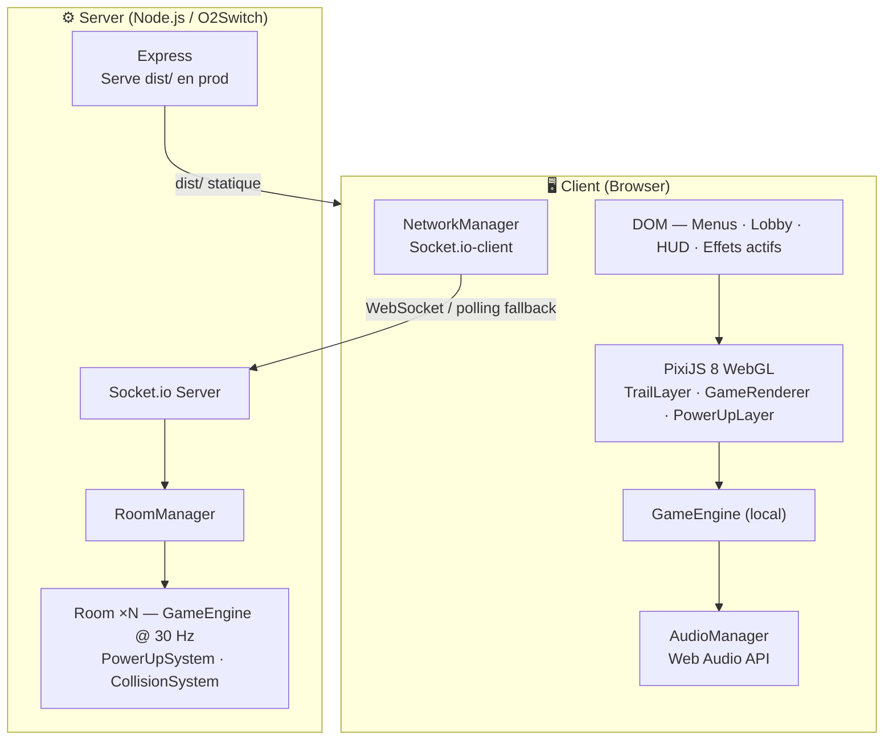
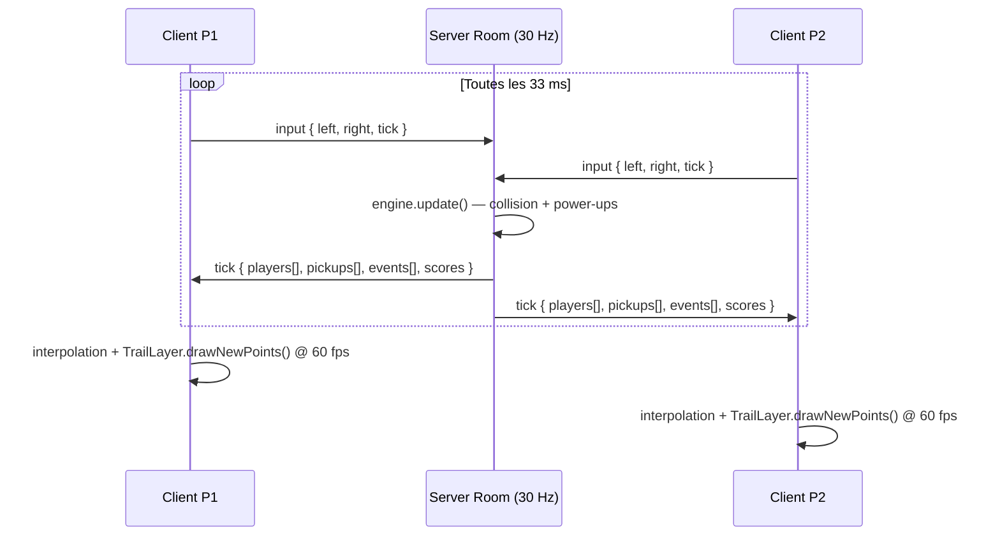
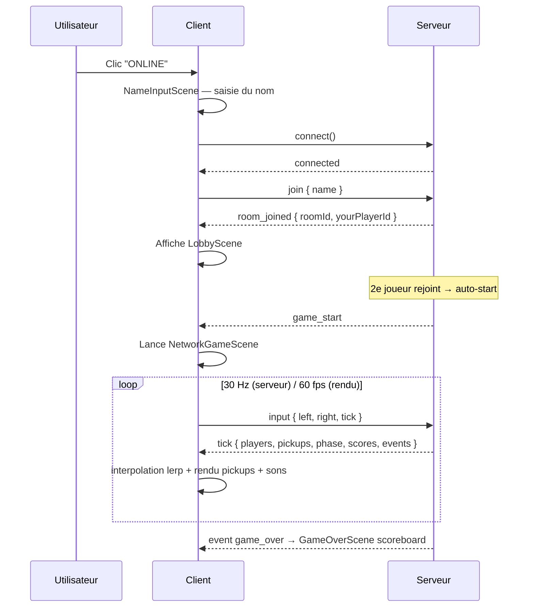
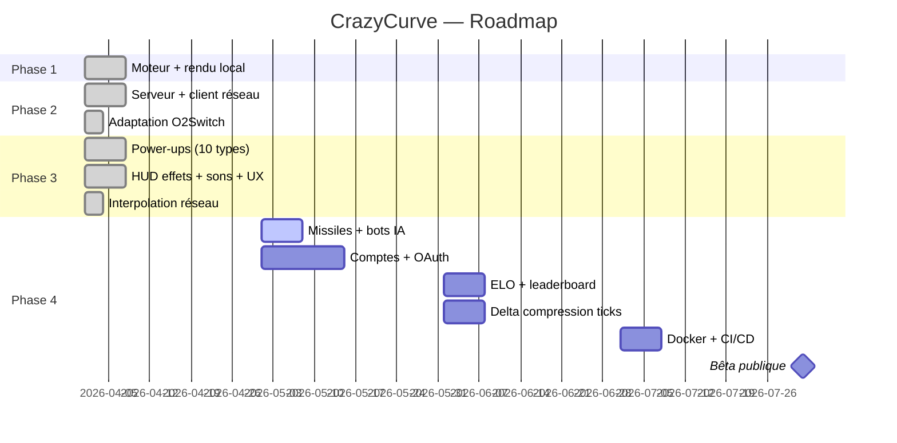

# CrazyCurve

> Multiplayer real-time Curve Fever clone — TypeScript · PixiJS 8 · Socket.io · Node.js


---

## Table des matières

- [Aperçu](#aperçu)
- [Architecture](#architecture)
- [Fonctionnalités](#fonctionnalités)
- [Power-ups](#power-ups)
- [Stack technique](#stack-technique)
- [Démarrage rapide](#démarrage-rapide)
- [Mode multijoueur](#mode-multijoueur)
- [Déploiement O2Switch](#déploiement-o2switch)
- [Structure du projet](#structure-du-projet)
- [Roadmap](#roadmap)
- [FAQ](#faq)

---

## Aperçu

Les joueurs contrôlent une courbe qui se déplace en continu et laisse une traîne. Toucher une traîne ou un mur = mort. Dernier survivant = point. Premier à **5 points** gagne la partie. Des power-ups apparaissent sur l'arène et modifient les règles du jeu.

```
┌─────────────────────────────────────────┐
│  ···                               ···  │
│     ╲          ⚡FAST               ╱    │
│      ╲   P1 ●──────────          ╱      │
│       ╲    [SHIELD]      ╱ P2   ╱       │
│        ╲         ⊗ERASE ●──────╱        │
│         ──────────────────────          │
│  P1: FAST  GHOST        P2: REV         │
└─────────────────────────────────────────┘
   P1: ← →      P2: A D      Round 3 / 5
```

---

## Architecture

### Vue d'ensemble



### Boucle de jeu (mode online)



### Interpolation réseau

```
Server tick arrives (33 ms)      60 fps render frames
        │                         │    │    │    │
        ▼                         ▼    ▼    ▼    ▼
  prevPos = currentPos      x = lerp(prev, target, Δt/33ms)
  targetPos = snap.x/y      head moves smoothly between ticks
  lastTickAt = now()        trail painted at authoritative pos
```

Les positions `x/y/angle` de `ShadowCurve` sont des **getters** qui calculent `lerp(prev, target, α)` à chaque appel via `performance.now()` — fluidité 60 fps depuis des ticks 30 Hz sans client-side prediction.

### Collision — Bitmap O(1)

```
Arena 800×600 → Uint8Array (480 000 octets)
  0 = vide   1 = P1   2 = P2 … 6 = P6

paint(x, y, id, r)  → écriture circulaire rayon r (variable : THIN/THICK)
check(x, y)         → lecture 1 pixel → collision instantanée
erase(x, y, r)      → remise à 0 circulaire (power-up ERASE)
```

---

## Fonctionnalités

### Phase 1 ✅ — Prototype local

| Feature | Détail |
|---|---|
| Moteur déterministe | `core/GameEngine` — sans dépendance DOM, réutilisable côté serveur |
| Rendu WebGL | PixiJS 8, TrailLayer incrémental sur RenderTexture |
| Collision bitmap | Uint8Array O(1), indépendant de la taille des traînes |
| Trous aléatoires | Gaps dans la traîne (mécanique tactique) |
| 2 joueurs local | P1 `← →` · P2 `A D` · même clavier |
| Rounds & scoring | 5 rounds pour gagner |

### Phase 2 ✅ — Multijoueur en ligne

| Feature | Détail |
|---|---|
| Serveur autoritaire | Node.js + Socket.io, boucle fixe 30 Hz |
| Rooms dynamiques | Jusqu'à 6 joueurs, auto-start à 2 |
| Protocol typé | Types Socket.io partagés client↔serveur (TypeScript) |
| Fallback polling | Compatible Passenger/Apache (O2Switch) |
| Lobby temps réel | Liste joueurs, code room, saisie du nom |
| IGameState interface | Renderer unique pour mode local ET réseau |
| Interpolation réseau | `ShadowCurve` lerp — 60 fps fluide depuis ticks 30 Hz |

### Phase 3 ✅ — Power-ups & UX

| Feature | Détail |
|---|---|
| 10 power-ups | FAST · SLOW · REV · FREEZE · GHOST · THIN · THICK · WARP · SHIELD · ERASE |
| Spawn dynamique | Toutes les ~6 s, max 5 actifs, position safe aléatoire |
| Radius variable | Traîne fine (×0.5) / épaisse (×2.5) — collision bitmap adapté |
| HUD effets actifs | Labels colorés pré-alloués au-dessus de chaque score |
| Flèche de direction | Flèche sur la tête pendant le décompte (Curve Fever classique) |
| Saisie du nom | `NameInputScene` — champ texte, touche Entrée, fallback aléatoire |
| Scoreboard final | Trié par score, noms réels + couleurs, 👑 gagnant |
| Sons Web Audio | 7 sons synthétisés — aucun fichier audio requis |
| Effets réseau | `erase_zone` · `pickup` propagés dans `TickPayload.events` |

---

## Power-ups

Les pickups apparaissent comme des cercles animés (pulsation) avec leur label. Collecte par proximité (rayon 12 px).

| Icône | Nom | Effet | Cible | Durée |
|---|---|---|---|---|
| ⚡ | **FAST** | Vitesse ×1.7 | Soi | 5 s |
| 🐌 | **SLOW** | Vitesse ×0.5 | Adversaires | 5 s |
| ↔ | **REV** | Contrôles inversés gauche↔droite | Adversaires | 4 s |
| ❄ | **FREEZE** | Immobilise complètement | Adversaires | 3 s |
| 👻 | **GHOST** | Traîne invisible, passe à travers les trails | Soi | 4 s |
| — | **THIN** | Traîne fine (radius ×0.5) | Soi | 6 s |
| █ | **THICK** | Traîne épaisse (radius ×2.5) | Adversaires | 4 s |
| ✦ | **WARP** | Téléportation aléatoire + gap de sécurité | Soi | instant |
| 🛡 | **SHIELD** | Absorbe 1 collision de traîne, puis se consomme | Soi | 10 s |
| ⊗ | **ERASE** | Efface traînes bitmap + visuel dans un disque 44 px | Soi | instant |

### Interactions remarquables

- **GHOST + THICK adversaire** : tu passes dans leur traîne épaisse sans mourir
- **SHIELD + REV** : bouclier actif mais contrôles inversés — désorientation totale
- **ERASE** : l'effacement visuel utilise `blendMode: 'erase'` PixiJS — les pixels deviennent transparents (pas juste masqués)
- **WARP** : la courbe réapparaît avec un gap temporaire (20 frames) pour éviter l'auto-collision

---

## Sons

`AudioManager` utilise la **Web Audio API** pure — aucun fichier audio, sons synthétisés par oscillateurs.

| Évènement | Son |
|---|---|
| Décompte 3, 2, 1 | Bip carré court (523 Hz) |
| GO ! | Deux tons ascendants (784 → 1047 Hz) |
| Mort | Ton sawtooth grave descendant |
| Pickup standard | Deux bips aigus montants |
| SHIELD activé | Confirmation harmonique |
| ERASE | Deux tons descendants |
| Victoire round | Arpège montant 3 notes |
| Victoire partie | Arpège montant 4 notes |

> Le contexte audio est déverrouillé au premier `pointerdown` (contrainte navigateur).

---

## Stack technique

| Couche | Technologie | Version |
|---|---|---|
| Rendu | PixiJS (WebGL) | 8.x |
| Frontend | TypeScript strict | 5.7 |
| Build | Vite | 6.x |
| Réseau client | Socket.io-client | 4.x |
| Serveur HTTP | Express | 4.x |
| Temps réel | Socket.io | 4.x |
| Runtime serveur | Node.js | 22 |
| Bundle prod | esbuild | 0.25 |
| Tests | Vitest | 2.x |
| Qualité | ESLint 9 + Prettier 3 | — |

---

## Démarrage rapide

### Prérequis

```bash
node -v   # >= 22
npm -v    # >= 10
```

### Installation

```bash
git clone https://github.com/artkabis/crazycurve.git
cd crazycurve
git checkout claude/curvefever-exploration-H2vUb
npm install
```

### Mode local (2 joueurs, même clavier)

```bash
npm run dev
# → http://localhost:5173   Cliquer "LOCAL (2P)"
```

### Mode multijoueur (développement)

```bash
# Terminal 1
npm run server:dev

# Terminal 2
npm run dev
# Ouvrir 2 onglets sur http://localhost:5173 → ONLINE → saisir son nom → JOIN
```

| Joueur | Gauche | Droite |
|---|---|---|
| P1 | `←` | `→` |
| P2 | `A` | `D` |
| Online | `←` | `→` (chaque joueur sur sa machine) |

---

## Mode multijoueur

### Flow de connexion



### Protocole réseau

**Client → Serveur**
```ts
socket.emit('join',  { name: string, roomId?: string })
socket.emit('input', { tick: number, left: boolean, right: boolean })
```

**Serveur → Client**
```ts
socket.on('room_joined',   ({ roomId, yourPlayerId, players }))
socket.on('player_joined', (player: PlayerInfo))
socket.on('game_start',    ())
socket.on('tick',          ({
  tick, phase, round, countdown,
  players: PlayerSnapshot[],   // x, y, angle, trailRadius, ghostTrail, activeEffects
  pickups: PickupSnapshot[],   // id, x, y, type
  events: NetGameEvent[],      // player_died | round_over | game_over | erase_zone
  scores: Record<number, number>
}))
socket.on('error', (message: string))
```

---

## Déploiement O2Switch

> Architecture : **tout-en-un** — Express sert `dist/` (front) + Socket.io (back) sur le port géré par Phusion Passenger.

### Étape 1 — Builder en local

```bash
npm run build:all
# → dist/                    (frontend Vite)
# → server/dist/server.cjs   (backend bundlé esbuild, prêt pour Node)
```

### Étape 2 — Configurer dans cPanel

```
cPanel → Setup Node.js App → Create Application

  Node.js version   : 22.x
  Application mode  : Production
  Application root  : /home/<user>/crazycurve
  Application URL   : game.tondomaine.fr
  Startup file      : server/dist/server.cjs
```

**Variables d'environnement** (cPanel → Node.js App → Env Vars) :

```
NODE_ENV = production
```

> `PORT` est injecté automatiquement par Passenger — ne pas le redéfinir.

### Étape 3 — Déployer via SSH

```bash
ssh user@ssh.tonserveur.o2switch.net
cd ~/crazycurve
git pull origin claude/curvefever-exploration-H2vUb
npm install --omit=dev
npm run build:all
# Puis : cPanel → Node.js App → Restart
```

### Étape 4 — Vérifier

```bash
curl https://game.tondomaine.fr/health
# {"status":"ok","uptime":12.3,"rooms":0}
```

### Notes spécifiques O2Switch

| Point | Comportement |
|---|---|
| WebSockets | Tentés en priorité via LiteSpeed |
| Fallback | Polling HTTP automatique si WS bloqués |
| PORT | Injecté par Passenger — ne pas hardcoder |
| Restart | cPanel ou `touch tmp/restart.txt` |
| Logs | cPanel → Errors / Node.js App logs |

---

## Structure du projet

```
crazycurve/
├── src/                           # Frontend
│   ├── core/                      # ← Isomorphe client/serveur
│   │   ├── constants.ts           # Arena, physics, palette 6 joueurs, power-up configs
│   │   ├── types.ts               # IGameState, CurveRenderData, PowerUpType, GameEvents…
│   │   ├── EventEmitter.ts        # Émetteur générique typé
│   │   ├── GameEngine.ts          # Machine d'état + PowerUpSystem intégré
│   │   ├── entities/
│   │   │   ├── Curve.ts           # Physique, gaps, effets actifs, bouclier, téléport
│   │   │   └── PowerUp.ts         # Entité Pickup (id, position, type)
│   │   └── systems/
│   │       ├── CollisionSystem.ts # Bitmap O(1) — paint / check / erase (radius variable)
│   │       ├── PowerUpSystem.ts   # Spawn · collecte · application · callbacks événements
│   │       └── ScoreSystem.ts
│   ├── renderer/
│   │   ├── TrailLayer.ts          # RenderTexture incrémentale + erase (blendMode)
│   │   ├── GameRenderer.ts        # IGameState → scène PixiJS, HUD effets, flèche direction
│   │   └── PowerUpLayer.ts        # Cercles pulsants animés pour les pickups
│   ├── audio/
│   │   └── AudioManager.ts        # Web Audio API — 7 sons synthétisés, unlock sur gesture
│   ├── input/InputManager.ts
│   ├── network/
│   │   ├── protocol.ts            # Types Socket.io partagés (TickPayload, snapshots…)
│   │   ├── NetworkManager.ts      # Client WS + polling fallback
│   │   └── NetworkGameState.ts    # IGameState ← ticks serveur + interpolation lerp
│   ├── scenes/
│   │   ├── MenuScene.ts           # Local / Online
│   │   ├── NameInputScene.ts      # Saisie du nom avant de rejoindre
│   │   ├── GameScene.ts           # Mode local (ticker PixiJS)
│   │   ├── NetworkGameScene.ts    # Mode online — ticks · interpolation · sons · erase
│   │   ├── LobbyScene.ts          # Salle d'attente
│   │   └── GameOverScene.ts       # Scoreboard complet trié, 2–6 joueurs
│   ├── app.ts                     # Orchestrateur principal + câblage audio/events
│   ├── main.ts
│   └── style.css
│
├── server/
│   ├── src/
│   │   ├── game/
│   │   │   ├── Room.ts            # Boucle 30 Hz, GameEngine, events → TickPayload
│   │   │   └── RoomManager.ts     # Registre rooms, auto-start à MIN_PLAYERS
│   │   └── server.ts              # Express + Socket.io + dist/ en prod + /health
│   └── tsconfig.json
│
├── index.html
├── package.json                   # Scripts : dev, build:all, start, server:dev
├── tsconfig.json
├── vite.config.ts                 # Proxy /socket.io → :3001 en dev
├── eslint.config.js
└── prettier.config.js
```

---

## Roadmap



---

## FAQ

<details>
<summary><strong>Le jeu fonctionne-t-il sans serveur ?</strong></summary>

Oui. Le mode **LOCAL (2P)** tourne entièrement dans le navigateur — moteur, collision, power-ups, sons. Seul le mode **ONLINE** nécessite le serveur Node.js.

</details>

<details>
<summary><strong>Comment fonctionne l'interpolation réseau ?</strong></summary>

`ShadowCurve` stocke `prevX/Y` et `targetX/Y`. Les propriétés `x`, `y`, `angle` sont des **getters** qui calculent `prev + (target - prev) × α` où `α = min(1, Δt / 33ms)`. Appelés 60 fois par seconde, ils retournent une position différente à chaque frame sans nouveau tick serveur — fluidité complète sans client-side prediction.

</details>

<details>
<summary><strong>Combien de rooms simultanées sur O2Switch ?</strong></summary>

Chaque room consomme ~480 KB (bitmap collision) + CPU d'une boucle 30 Hz. Sur un mutualisé O2Switch, prévoir 20–50 rooms max. Pour plus, passer sur un VPS dédié.

</details>

<details>
<summary><strong>Socket.io ne se connecte pas sur O2Switch — que faire ?</strong></summary>

1. Tester `/health` — si 200, le serveur tourne.
2. Console navigateur : si WebSocket échoue, Socket.io bascule en **polling HTTP** automatiquement.
3. Si même le polling échoue : vérifier que le sous-domaine pointe bien vers l'Application Root du Node.js App cPanel.

</details>

<details>
<summary><strong>Les sons ne jouent pas ?</strong></summary>

Les navigateurs bloquent `AudioContext` avant toute interaction utilisateur. `AudioManager.unlock()` est appelé sur le premier `pointerdown` (clic/tap). Si aucun son ne joue, cliquer une fois dans la page avant de lancer une partie.

</details>

<details>
<summary><strong>Comment redémarrer après un déploiement ?</strong></summary>

```bash
# Via SSH (Passenger détecte ce fichier)
touch ~/crazycurve/tmp/restart.txt

# Ou via cPanel → Setup Node.js App → Restart
```

</details>

<details>
<summary><strong>Comment ajouter un 3e joueur en local ?</strong></summary>

Le mode local est limité à P1+P2 (même clavier). Pour 3+ joueurs, utiliser le mode **ONLINE** en local : lancer `npm run server:dev` + ouvrir plusieurs onglets sur `localhost:5173` → chaque onglet saisit un nom et rejoint la même room automatiquement.

</details>

<details>
<summary><strong>Les données sont-elles persistées ?</strong></summary>

Non — tout est en mémoire (perdu au restart). La Phase 4 introduira un backend persistant pour comptes, ELO et historique de parties.

</details>

---

<sub>CrazyCurve · TypeScript · PixiJS 8 · Socket.io · Vite · Node.js 22</sub>
